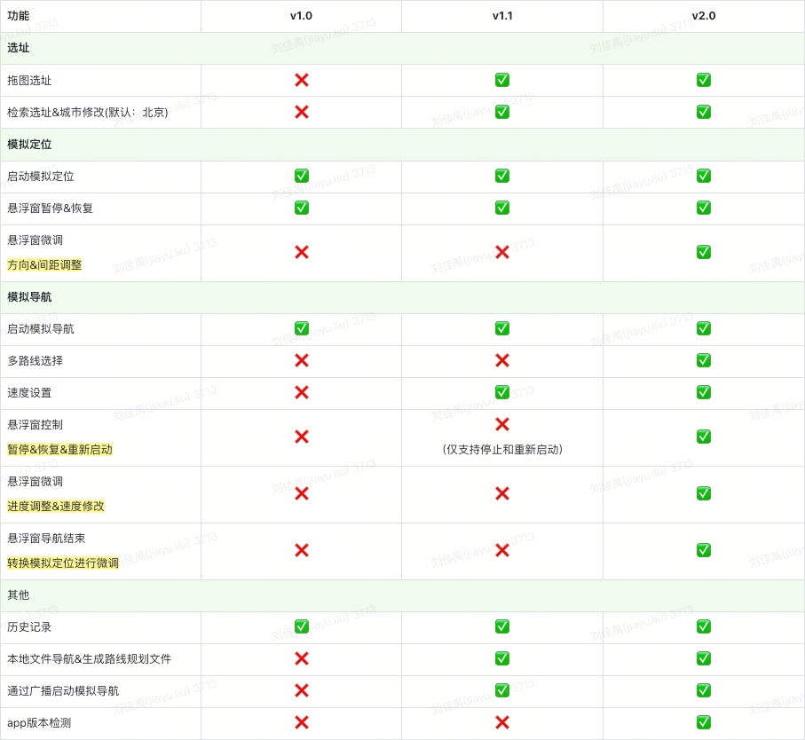
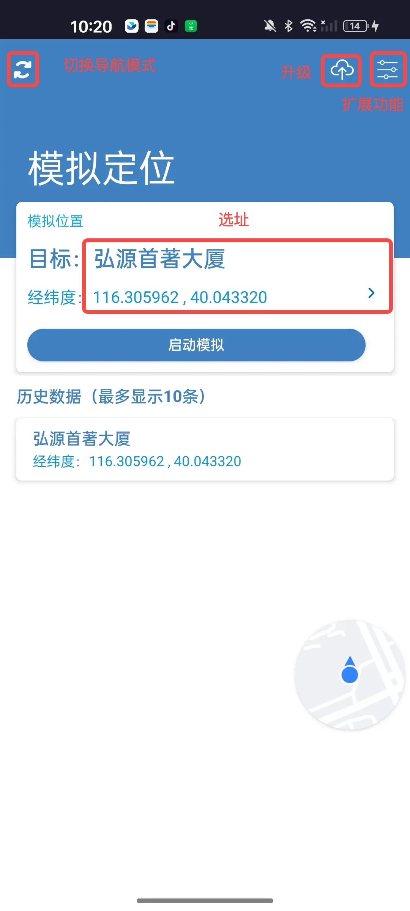
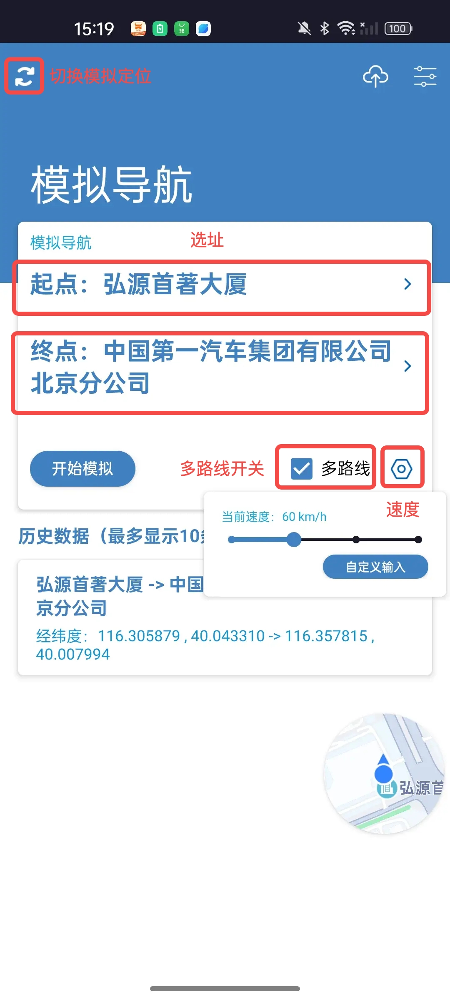
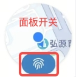
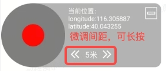
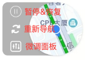
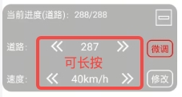

# MockGps #

# Apk DownLoad

 
<https://www.pgyer.com/hHJ9>
 

# 功能v2.0

 

**功能截图** 
<table border="1" >
    <tr valign="top">
        <td width="40%">
        
        </td>
        <td width="40%">
         
         
        </td>
        <td width="20%">
         
         
         
         
         
        </td>
    </tr>
</table>
 

# 注意

腾讯类的应用无法模拟定位，腾讯定位默认有防模拟定位功能。该软件实现是基于系统API实现，定位信息里会标识为模拟数据标识，如果第三方软件想判断是很简单的，软件仅供日常开发使用。

 

# 更新

* 2022.2.18 适配部分手机出现IllegalArgumentException异常，手里机型有限。 
* 2022.9.5  v1.1 优化选址模块、新增广播启动模拟导航功能、支持文件数据模拟&文件生成模块(多路线选择指定模块) 
* 2023.11.23 v2.0 增加微调功能，以及优化功能。 
* 2024.1.24 v2.0 测试完成
 

# 支持
近期看到下载量暴增，这款软件开发初期只是为我的工作以及团队提供一个调试的小软件，也是在工作中慢慢迭代。没想到有这么多朋友关注，对喜欢这款软件的朋友表示感谢，如果这款软件对你的学习或者工作有所帮助，不妨支持一下，您的支持就是我最大的动力。感谢大家！

 

# 免责声明
此应用仅限开发学习和开发使用，软件的发布和使用均不收取任何费用。拒绝任何人或任何实体进行出售、重新修改后分发，严禁用于商业谋利用途。项目维护者对软件的滥用不承担任何责任。
 
 

# 功能预警
由于百度sdk需要收取api流量费用(政策修改，个人或者企业都不会提供免费额度)，后续百度sdk相关功能会无法使用。
